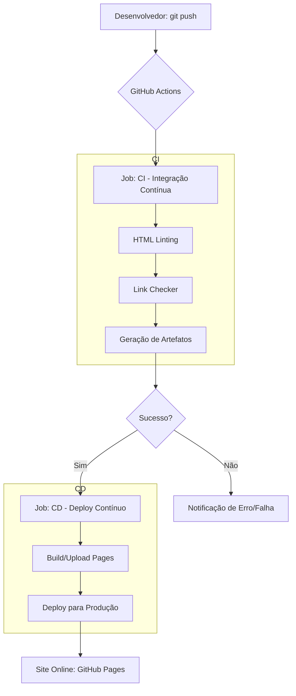

# Projeto CI/CD Automatizado com GitHub Actions 🚀


Este repositório foi desenvolvido como parte de uma atividade prática de DevOps, com o objetivo de criar, configurar e validar um pipeline de CI/CD completo utilizando Git, GitHub e GitHub Actions.

## 🔗 Link do Projeto
Você pode visualizar o site publicado automaticamente aqui:
👉 **[Ver site no GitHub Pages](https://Jackie-Ventura.github.io/Pipeline-CI-CD/)**

---

## 📋 Objetivo da Atividade
Simular um fluxo real de trabalho DevOps, abrangendo:
- **Controle de versão:** Uso do Git para gestão de código.
- **CI (Integração Contínua):** Validação automática de arquivos e geração de artefatos.
- **CD (Deploy Contínuo):** Publicação automática no GitHub Pages após o sucesso da integração.
- **Monitoramento:** Observação de logs, métricas e artefatos gerados.

---

## 🛠️ Estrutura do Projeto
O projeto segue a estrutura organizacional abaixo:
```text
.
├── .github/
│   └── workflows/
│       ├── ci.yml    # Pipeline de Integração Contínua
│       └── cd.yml    # Pipeline de Deploy Contínuo (GitHub Pages)
├── site/
│   └── index.html    # Página estática simples
└── README.md         # Documentação do projeto
```

---

## ⚙️ Funcionamento dos Pipelines

### Fluxo de Trabalho (Pipeline Architecture)


### 1. CI - Integração Contínua (`ci.yml`)
Disparado em cada `push` ou `pull request` para a branch `main`.
- **Checkout:** Obtém o código do repositório.
- **Validação:** Verifica a integridade do arquivo `index.html`.
- **Lint Simples:** Garante que as tags HTML essenciais existam.
- **Artefato:** Gera e armazena um arquivo comprimido do site para auditoria.

### 2. CD - Deploy Contínuo (`cd.yml`)
Disparado automaticamente apenas quando o pipeline de **CI** é concluído com sucesso.
- **Setup:** Configura o ambiente de deploy para o GitHub Pages.
- **Upload:** Envia o conteúdo da pasta `/site` para os servidores do GitHub.
- **Deployment:** Publica o site na URL oficial.

---

## 🚀 Como reproduzir
1. Clone este repositório.
2. Faça uma alteração no arquivo `site/index.html`.
3. Envie as mudanças para o GitHub (`git push`).
4. Acompanhe a execução na aba **Actions** do seu repositório.

---
*Desenvolvido como atividade prática de DevOps.*
